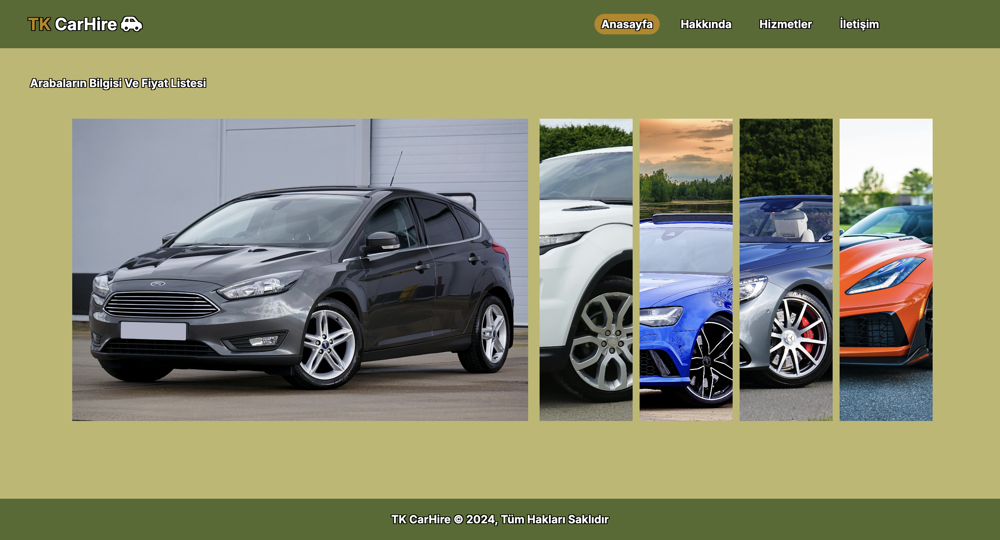
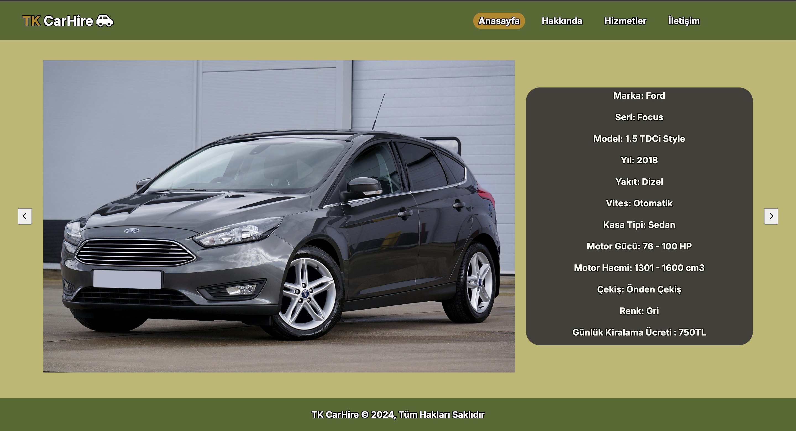
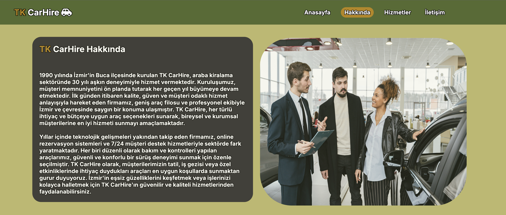
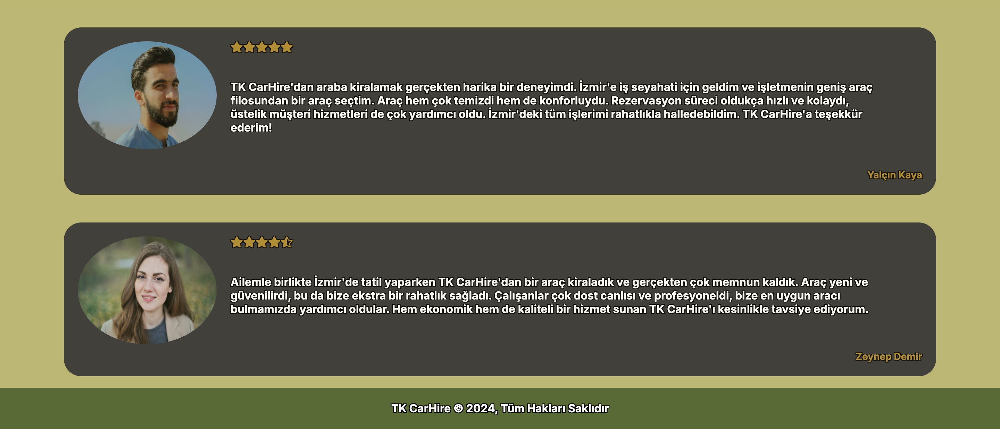
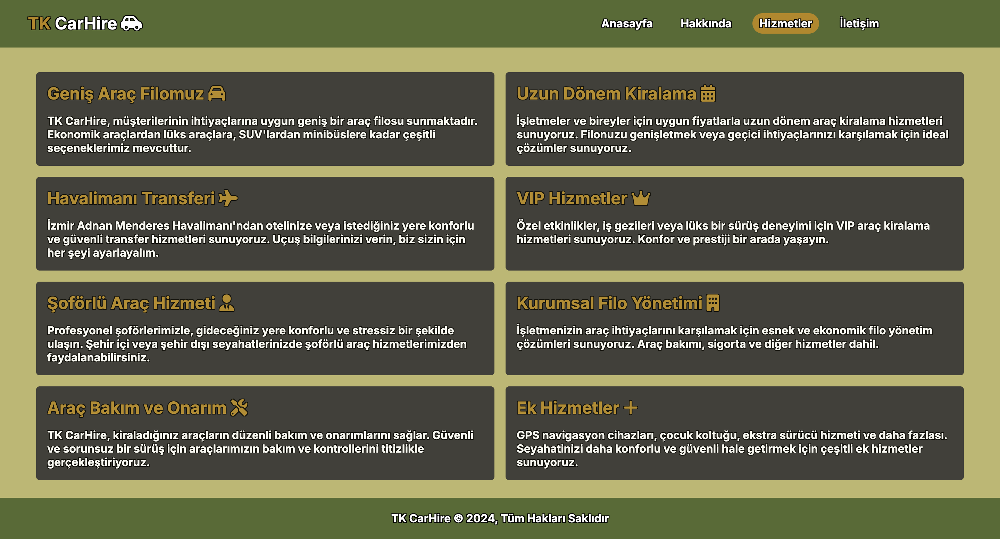
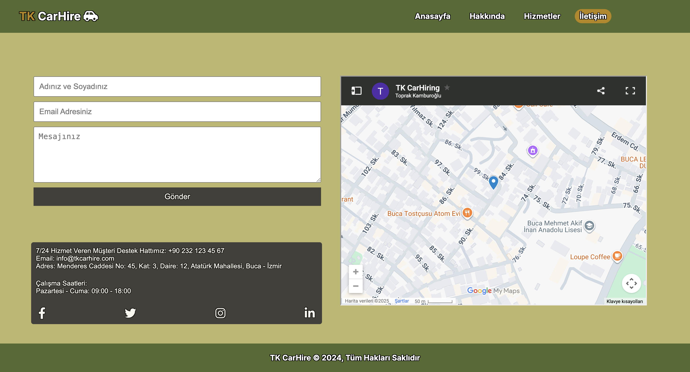

# TK CarHire - Personal Car Rental Website

## 📋 Project Overview

TK CarHire is a personal car rental website project developed to improve HTML, CSS, and JavaScript skills. This project features a modern, responsive design with interactive elements and showcases various car rental services.

## 🖼️ Website Screenshots

<!-- Image carousel showing different pages -->
<div align="center">

### 🏠 Homepage

<br></br>

### 💰 Pricing Page

<br></br>

### ℹ️ About Us Page


<br></br>

### 🔧 Services Page

<br></br>

### 📞 Contact Page

<br></br>

</div>

---

### 📱 Page Navigation
| Page | Description | Screenshot |
|------|-------------|------------|
| **Home** | Main landing page with featured cars | [View](images/anasayfa.png) |
| **Pricing** | Rental rates and packages | [View](images/fiyatlar.png) |
| **About** | Company information and history | [View](images/hakkında.png) |
| **Services** | Available services and features | [View](images/hizmetler.png) |
| **Contact** | Get in touch with us | [View](images/iletişim.png) |
| **Reviews** | Customer experiences | [View](images/yorum.png) |

## 🚗 Features

- **Responsive Design**: Works seamlessly across desktop, tablet, and mobile devices
- **Modern UI**: Clean and professional interface design
- **Interactive Navigation**: Smooth navigation between different sections
- **Car Gallery**: Showcase of available vehicles with high-quality images
- **Service Pages**: Detailed information about rental services
- **Contact Form**: Easy way for customers to get in touch
- **Image Carousel**: Interactive slideshow for displaying car images

## 📁 Project Structure

```
TK CarHire/
├── index.html          # Homepage
├── about.html          # About us page
├── hizmetler.html      # Services page
├── bilgi.html          # Information page
├── contact.html        # Contact page
├── style.css           # Main stylesheet
├── .DS_Store          # System file (macOS)
└── Car Images:
    ├── audi.jpg
    ├── corvette.jpg
    ├── ford.jpg
    ├── mercedes.jpg
    ├── rangerover.jpg
    ├── dealership.jpg
    ├── erkek.jpg
    └── kadın.jpg

images/ (Screenshots)
├── anasayfa.png        # Homepage screenshot
├── fiyatlar.png        # Pricing page screenshot
├── hakkında.png        # About page screenshot
├── hizmetler.png       # Services page screenshot
├── iletişim.png        # Contact page screenshot
└── yorum.png           # Reviews page screenshot
```


## 🛠️ Technologies Used

- **HTML5**: Structure and content
- **CSS3**: Styling, animations, and responsive design
- **JavaScript**: Interactive functionality and carousel behavior
- **Responsive Design**: Mobile-first approach

## 📱 Responsive Features

- Flexible grid layout
- Mobile-optimized navigation
- Scalable images
- Touch-friendly carousel controls
- Adaptive font sizes

## 🎯 Learning Objectives

This project helps develop skills in:

- **HTML**: Semantic markup, form creation, page structure
- **CSS**: Flexbox, Grid, animations, responsive design
- **JavaScript**: DOM manipulation, event handling, carousel functionality
- **Web Design**: User experience, visual hierarchy, color theory
- **Project Organization**: File structure, code organization

## 🚀 Getting Started

1. Clone or download the project files
2. Open `index.html` in your web browser
3. Navigate through different pages to explore features
4. Modify the code to experiment with different styles and functionality

## 📈 Future Enhancements

-  Add booking system functionality
-  Implement price calculator
-  Add customer review system
-  Include map integration for pickup locations
-  Add vehicle availability checker
-  Implement search and filter functionality

## 🤝 Contributing

This is a personal learning project, but suggestions and feedback are always welcome!

## 📄 License

This project is for educational purposes and personal skill development.

---

**Note**: This is a learning project focused on improving HTML, CSS, and JavaScript skills. The carousel feature enhances the visual appeal and provides hands-on experience with interactive web components.
